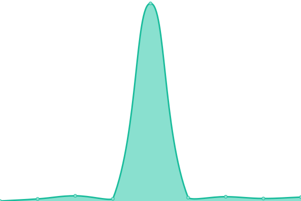

# [📈 Live Status](https://dblitt.github.io/upptime): <!--live status--> **🟩 All systems operational**

This repository contains the open-source uptime monitor and status page for [Daniel Blittschau](https://dblitt.com), powered by [Upptime](https://github.com/upptime/upptime).

With [Upptime](https://upptime.js.org), you can get your own unlimited and free uptime monitor and status page, powered entirely by a GitHub repository. We use [Issues](https://github.com/dblitt/upptime/issues) as incident reports, [Actions](https://github.com/dblitt/upptime/actions) as uptime monitors, and [Pages](https://dblitt.github.io/upptime) for the status page.

<!--start: status pages-->
<!-- This summary is generated by Upptime (https://github.com/upptime/upptime) -->
<!-- Do not edit this manually, your changes will be overwritten -->
<!-- prettier-ignore -->
| URL | Status | History | Response Time | Uptime |
| --- | ------ | ------- | ------------- | ------ |
|  [Vaultwarden](https://vault.dblitt.com) | 🟩 Up | [vaultwarden.yml](https://github.com/dblitt/upptime/commits/HEAD/history/vaultwarden.yml) | 

 202ms
     
 | 

<a href="https://dblitt.github.io/upptime/history/vaultwarden">100.00%</a>
    

|  [Paperless](https://paperless.dblitt.com) | 🟩 Up | [paperless.yml](https://github.com/dblitt/upptime/commits/HEAD/history/paperless.yml) | 

 505ms
     
 | 

<a href="https://dblitt.github.io/upptime/history/paperless">99.73%</a>
    

|  [Jellyfin](https://jellyfin.dblitt.com) | 🟩 Up | [jellyfin.yml](https://github.com/dblitt/upptime/commits/HEAD/history/jellyfin.yml) | 

 614ms
     
 | 

<a href="https://dblitt.github.io/upptime/history/jellyfin">99.73%</a>
    

|  [TheLounge](https://lounge.dblitt.com) | 🟩 Up | [the-lounge.yml](https://github.com/dblitt/upptime/commits/HEAD/history/the-lounge.yml) | 

 232ms
     
 | 

<a href="https://dblitt.github.io/upptime/history/the-lounge">100.00%</a>
    

<!--end: status pages-->

[**Visit our status website →**](https://dblitt.github.io/upptime)

## 📄 License

- Powered by: [Upptime](https://github.com/upptime/upptime)
- Code: [MIT](./LICENSE) © [Anand Chowdhary](https://anandchowdhary.com), supported by [Pabio](https://pabio.com)
- Data in the `./history` directory: [Open Database License](https://opendatacommons.org/licenses/odbl/1-0/)
